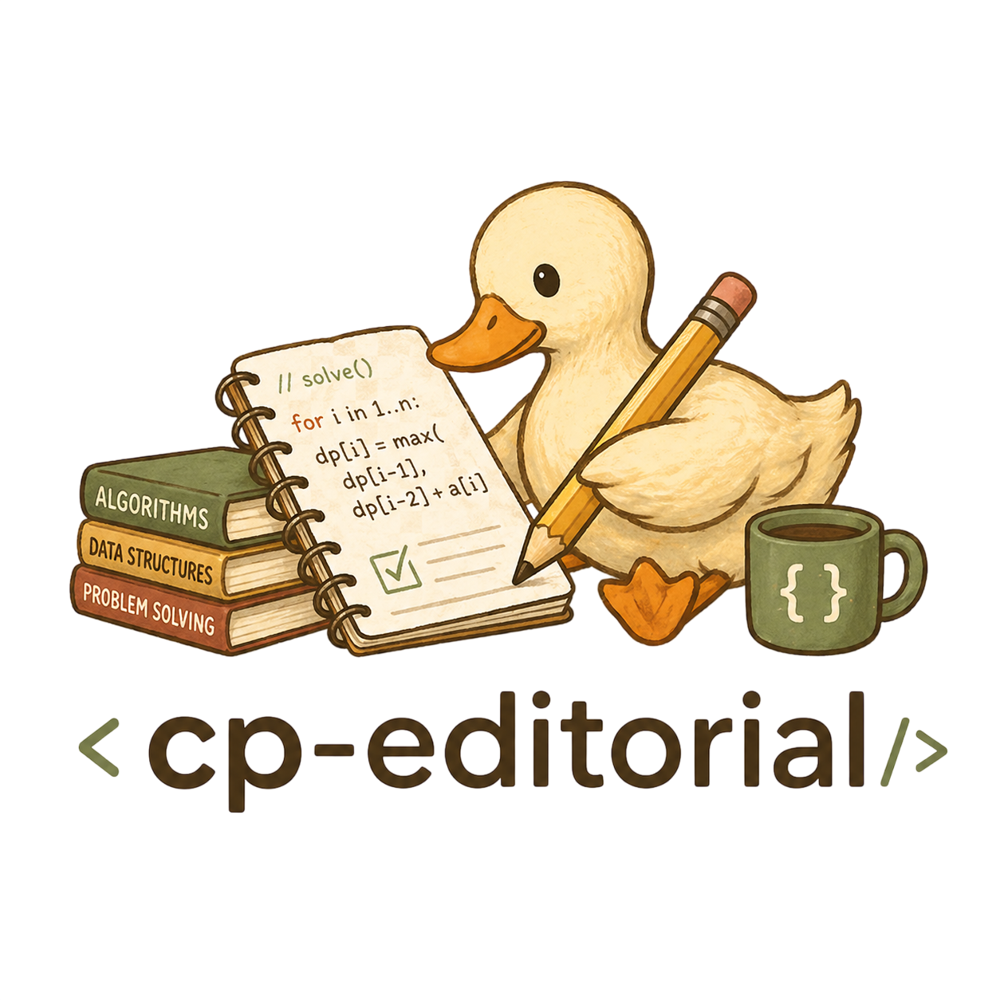

# Editorial Data for Competitive Programming Contests

<p align="center">
  
</p>

[](https://github.com/utilForever/cp-editorial-data)
[](https://github.com/utilForever/cp-editorial-data/actions/workflows/trigger.yml)
[](./LICENSE)

Editorial data repository for competitive programming contests and problem sets.

## Quick Start

```bash
git clone https://github.com/utilForever/cp-editorial-data.git
cd cp-editorial-data
```

1. Browse the top-level categories (`Olympiad`, `Open Cup`, `Petrozavodsk Programming Camp`, `School`, `University`, `User Contest`).
2. Navigate to the relevant organizer/season folder.
3. Open the target editorial PDF file.

## Architecture

The repository is a hierarchical dataset of editorial PDF files. Paths follow this convention:

`<Category>\<Organization or Series>\<Contest or Season>\<File>.pdf`

Examples:

- `Petrozavodsk Programming Camp\Summer 2024\Day 1 - Welcome Contest.pdf`
- `Open Cup\XXI Open Cup named after E.V. Pankratiev\Stage 14 - Grand Prix of Tokyo.pdf`

On updates to `main`, the GitHub Actions workflow in `.github/workflows/trigger.yml` dispatches an event to `utilForever/cp-editorial-frontend`.

## Contributing

Contributions are welcome. Please review:

- [CONTRIBUTING.md](./CONTRIBUTING.md) for workflow and naming/path conventions.
- [.github/PULL_REQUEST_TEMPLATE.md](./.github/PULL_REQUEST_TEMPLATE.md) for the PR checklist.
- [.github/ISSUE_TEMPLATE](./.github/ISSUE_TEMPLATE) for correction, attribution, and removal requests.

## Copyright

The copyright of each editorial file belongs to its original author, publisher, or contest organizer. This repository organizes and distributes editorial references for educational and archival purposes.

If you are a rights holder and need a correction, attribution update, or removal, please open an issue using the templates in `.github/ISSUE_TEMPLATE`.

## License


The class is licensed under the [MIT License](https://opensource.org/licenses/MIT):

Copyright &copy; 2026 [Chris Ohk](https://www.github.com/utilForever).

Permission is hereby granted, free of charge, to any person obtaining a copy of this software and associated documentation files (the "Software"), to deal in the Software without restriction, including without limitation the rights to use, copy, modify, merge, publish, distribute, sublicense, and/or sell copies of the Software, and to permit persons to whom the Software is furnished to do so, subject to the following conditions:

The above copyright notice and this permission notice shall be included in all copies or substantial portions of the Software.

THE SOFTWARE IS PROVIDED "AS IS", WITHOUT WARRANTY OF ANY KIND, EXPRESS OR IMPLIED, INCLUDING BUT NOT LIMITED TO THE WARRANTIES OF MERCHANTABILITY, FITNESS FOR A PARTICULAR PURPOSE AND NONINFRINGEMENT. IN NO EVENT SHALL THE AUTHORS OR COPYRIGHT HOLDERS BE LIABLE FOR ANY CLAIM, DAMAGES OR OTHER LIABILITY, WHETHER IN AN ACTION OF CONTRACT, TORT OR OTHERWISE, ARISING FROM, OUT OF OR IN CONNECTION WITH THE SOFTWARE OR THE USE OR OTHER DEALINGS IN THE SOFTWARE.
